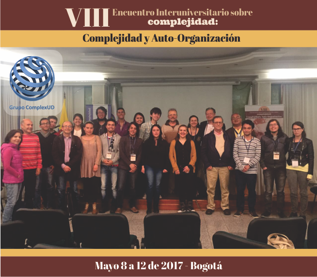

ComplexUD es un grupo de investigación interdisciplinario, ya que el tema de la complejidad requiere del enlace de distintas áreas del conocimiento.  Sus integrantes son estudiantes en su mayoría de ingeniería de sistemas, ingeniería electrónica e ingeniería industrial de la Universidad Distrital, también lo integran estudiantes de medicina y administración de otras universidades.

Desde el año 2006 ComplexUD organiza el ‘Encuentro interuniversitario obre complejidad’, este año llegó a su séptima versión, teniendo como eje principal la sociedad y complejidad.

Complex UD es un grupo muy dinámico. Organizan internamente tutorías voluntarias cada semana  en ciencias de la complejidad, también seminarios cada quince días con estudiantes que están desarrollando su tesis en torno a las líneas de investigación del grupo,  haciendo un intercambio de información de una manera muy dinámica.

El grupo ha realizado importantes proyectos de investigación, desarrollando algoritmos basados en el comportamiento de diversas especies animales como las hormigas, las abejas y las aves para solucionar problemas de complejidad como por ejemplo rutas en las redes de computación, rutas de evacuación y la aviación. Demostrando que el comportamiento de la naturaleza puede ser un gran aliado para encontrar la solución a diferentes temas de complejidad que tiene el hombre.

Fuente: *http://laud.udistrital.edu.co/noticias/complexud-grupo-de-investigaci%C3%B3n-de-las-ciencias-de-la-complejidad*

