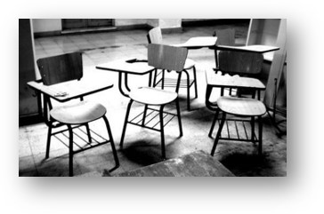
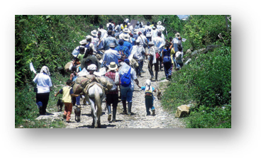

*  **CREACIÓN DE UNA ARQUITECTURA DE REDES NEURONALES CON UN ENFOQUE MODULAR PARA LA CREACIÓN DE CÓDIGO FUENTE HTML Y CSS A PARTIR DE MOCKUPS**:
Desarrollado por: Camilo Hernández y Jonathan Rodríguez

* **HERRAMIENTA INFORMÁTICA PARA LA IDENTIFICACIÓN DE MENORES MALTRATADOS ENTRE LOS 4 Y 6 AÑOS EN LA CIUDAD DE BOGOTÁ**:
Desarrollado por: Lorena Castiblanco y Victor Villamil

* **CRIPTOSISTEMA ESTEGANOGRÁFICO A TRAVÉS DE IMÁGENES DIGITALES PARA EL CIFRADO DE TEXTO USANDO TEORÍA DEL CAOS Y AUTÓMATAS CELULARES**:
Desarrollado por: Marlon Arias

* **DESARROLLO E IMPLEMENTACIÓN DE UN SISTEMA DE ANÁLISIS MATEMÁTICO DE COMPLEJIDAD FRACTAL EN SEÑALES EEG**:
Desarrollado por: Miguel Ángel Buitrago

* **ALGORITMOS DE APRENDIZAJE AUTOMÁTICO: UNA HERRAMIENTA PARA EL ANÁLISIS DE DATOS SOBRE GERMINACIÓN EN SEMILLAS**:
Desarrollado por: Cristian Manuel Bernal y Juan Diego Ávila

* **SISTEMA PARA ENCRIPTACIÓN DE ARCHIVOS MULTIMEDIA A PARTIR DE ATRACTORES CAÓTICOS Y TEORÍA DE CUATERNIONES**:
Desarrollado por: Luis Enrique Mendez y Daniel Esteban Ladino

* **MODELAMIENTO Y SIMULACIÓN DE INTERACCIONES ESTUDIANTILES QUE INTERVIENEN EN LA VIOLENCIA EMERGENTE DENTRO DEL AULA DE CLASE**:
Desarrollado por: Fernando Páez

* **MODELO DE UN SISTEMA INMUNOLÓGICO ARTIFICIAL BASADO EN LA TEORÍA DE THOMAS PRADEU**:
Desarrollado por: Edwin Pinilla

* **APLICACIONES DE LA VIDA ARTIFICIAL Y LA INGENIERÍA MORFOGENÉTICA AL DISEÑO DE INTERFACES DE USUARIO**:
Desarrollado por: Leyini Parra

* **USO DE LA SIMULACIÓN Y DE LA METODOLOGÍA DE ANÁLISIS DE REDES SOCIALES COMO TÉCNICA DE INVESTIGACIÓN SOBRE EL IMPACTO DE LAS TECNOLOGÍAS DE LA INFORMACIÓN Y COMUNICACIÓN EN LAS INTERACCIONES SOCIO COMUNICATIVAS DE LA FAMILIA NUCLEAR**:
Desarrollado por: Diego Alexander Ramírez Buitrago

* **MODELADO Y SIMULACIÓN DEL PROCESO ADAPTATIVO DE LA POBLACIÓN DESPLAZADA UBICADA EN LAS LOCALIDADES KENNEDY Y CIUDAD BOLÍVAR EN BOGOTÁ D.C.**:
Desarrollado por: Pilar García y Camilo Torres

* **MODELAMIENTO Y SIMULACIÓN DEL FENÓMENO DE DESERCIÓN Y RETENCIÓN ESTUDIANTIL UNIVERSITARIA TRATADO COMO SISTEMA COMPLEJO**:
Desarrollado por: Martha Castellanos

* **MODELO PARA LA VALIDACIÓN DEL CUMPLIMIENTO MISIONAL EN ENTIDADES DE CARÁCTER PÚBLICO**:
Desarrollado por: Constanza Ochoa y Joaquín Suárez

* **APLICACIÓN DE LA INGENIERIA DE SISTEMAS COMPLEJOS EN EL DISEÑO YDESARROLLO DE UN APLICATIVO LÚDICO QUE SIMULA ECOSISTEMAS**:
Desarrollado por: Andrés Villarraga

* **MODELADO Y SIMULACIÓN DEL PROCESO DE NAVEGACIÓN AÉREA, DESDE LA CREACIÓN DEL PLAN DE VUELO HASTA LA CULMINACIÓN DEL MISMO, SIN CONTROL CENTRALIZADO EN UN CONTEXTO DE VIDA ARTIFICIAL**:
Desarrollado por: Carlos Daza y Camilo Hurtado

* **MODELADO Y SIMULACIÓN DE LAS RUTAS DE LIMPIEZA Y RECOLECCIÓN DE RESIDUOS DEL HOSPITAL VISTA HERMOSA I NIVEL**:
Desarrollado por: Érica Vandenverge y Manuel Camargo

Otros:
* **Modelos de Encriptación Basados en Atractores Caóticos**
* **Participación en el proyecto Erasmus: Emple-AP**
* **Informalmente se viene trabajando en el modelado y simulación del contagio de COVID-19**  

