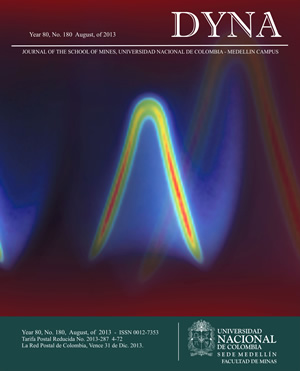
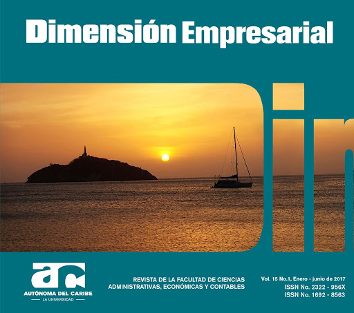
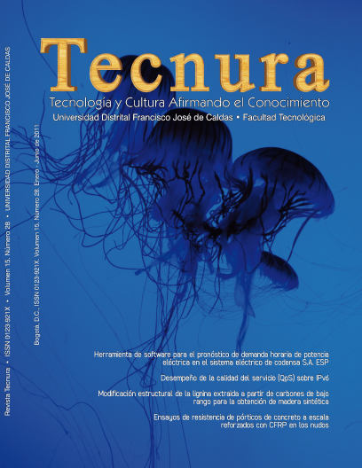

**Técnica para solución de recurrencias, usada en el análisis de la complejidad de algoritmos recursivos:** 
 * Revista: Tecnura
 * Año: 2015
 * Autores: Luis Emilio Montenegro Salcedo, Luz Deicy Alvarado Nieto

**Ausencia de respuesta de las organizaciones empresariales a las condiciones cambiantes del entorno: un problema de gestión de la complejidad**
* Revista: Pensamiento y Gestión
* Año publicación: 2016
* Autores: Luz Esperanza Bohórquez Arévalo

**Modelo de encriptación simétrica basada en atractores caóticos**
* Revista: Ingeniería
* Año publicación: 2016
* Autores: José Moreno, Fabio Parra, Rafael Huérfano, César Suárez, Isabel Amaya

**Understanding of Business Organizations and their Environment as Systems of Increasing Complexity: Features and Implications**
* Revista: Ingeniería
* Año publicación: 2016
* Autores: Luz Esperanza Bohórquez Arévalo

**Aplicación de agentes reactivos simples en la simulación de árboles pertenecientes a ecosistemas colombianos**
* Revista: Ideas en Ciencia
* Año publicación: 2017
* Autores: Jairo Andrés Villarraga Morales, Luz Deicy Alvarado Nieto

**Ingeniería de sistemas complejos y logística hospitalaria: modelamiento y simulación de la dinámica de aseo en el Hospital Vista Hermosa I Nivel**
* Revista: Editorial Universidad El Rosario
* Año publicación: 2018
* Autores: Manuel Camargo, Erika Van den Berghe, Jorge Eliecer Villamil, Nelson Gómez Cruz

**University Student Desertion Analysis using Agent-Based Modeling Approach**
* Revista: Complexus 2018
* Año publicación: 2018
* Autores: Martha Castellanos Rojas, Luz Deicy Alvarado Nieto, Jorge Villamil Puentes

**Paramo and High-Andean Simulation using Reactive Agents - Hydrological Role of High Andean Ecosystems**
* Revista: Complexus 2018
* Año publicación: 2018
* Autores: Luz Deicy Alvarado Nieto, Andres Villarraga Morales 

**Impacto de la Capacitación del Personal en la Productividad Empresarial**
* Revista: Dimensión Empresarial
* Año publicación: 2019
* Autores: Luz Esperanza Bohórquez Arévalo, Angie Stefani Caro Ballestas, Néstor David Morales

**Behavior of employability indicators in university graduates**
* Revista: Ingeniería Solidaria
* Año publicación: 2020
* Autores: Nicole Valentina Chacón Sánchez, Daniel Esteban Casas Mateus, Luz Deicy Alvarado Nieto

**Design of the organizational structure and coordination of an observatory based on collective intelligence**
* Revista: Ingeniería solidaria
* Año publicación: 2020
* Autores: Luz Esperanza Bohórquez Arévalo, Nelson Stiven Castillo Rodríguez, Mónica Sofia Farfán González

**Employability as a complex problem**
* Revista: Ingeniería Solidaria
* Año publicación: 2020
* Autores: Luisa Fernanda Hernández Corredor, Ronald Sneyder Beltrán Martínez

**Composite cellular automata-based encryption method applied to surveillance videos**
* Revista: DYNA
* Año publicación: 2020 
* Autores: Luis Miguel Cortes Martínez, Luz Deicy Alvarado Nieto, Edilma Isabel Amaya Barrera

**Propuesta de Estrategia para la Comprensión de la Crisis del Covid-19 en la ciudad de Bogotá desde Complejidad**
* Revista: Academia
* Año publicación: 2020
* Autores: Carlos Eduardo Maldonado, Luz Deicy Alvarado Nieto, Jorge Eliecer Villamil

## Revistas

    

    

    

    

    

    

